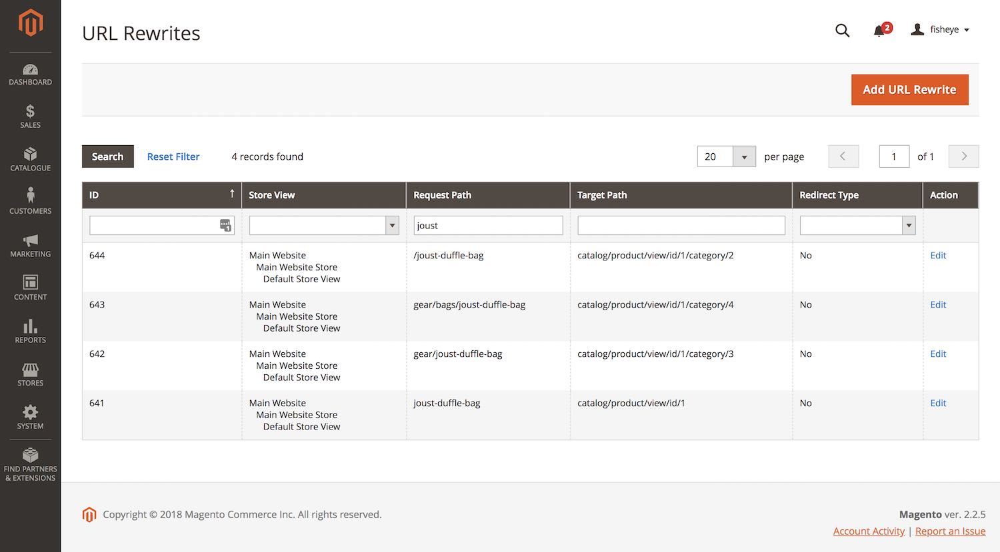
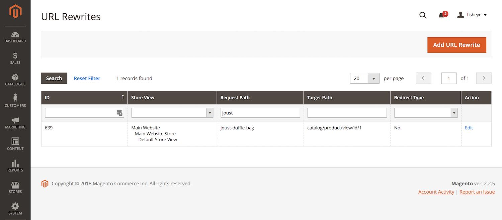

# Fisheye_UrlRewriteOptimiser

## Overview
A Magento module that stops URL rewrites with category paths being generated for products when 'Use Categories Path for Product URLs' setting is disabled in config.

## Features

* Stop needless URL rewrites for products that include category paths being created
* Only applies when 'Use Categories Path for Product URLs' setting is set to 'No'

> Note: this extension will only prevent category path based URL rewrites from being created.  Removing existing URL rewrites will need to be managed separately (though may be added in a future version).

## Issue

To highlight the issue (and purpose of this module) see the 2 scenarios below

### Without module enabled



* 'Joust Duffle Bag' product is in 2 categories ('Gear' and 'Bags')
* 4 product URL rewrite records are created for this product
    * 1 for the direct product URL
    * 3 for category path URLS (2 for the categories the product is associated to and also the root category...)  
* Overall 580 product URL rewrite records are created (using Magento's default sample data of 189 visible products and 39 categories)

### With module enabled



* 'Joust Duffle Bag' product  now just has 1 URL rewrite record for the direct path
* Overall reduced to 189 product URL rewrite records (i.e. 1 per visible product)
* Scale that up to thousands of products, categories, websites and store views and the space saved in the `url_rewrite` table could be huge!

## Compatibility

* PHP 7.x
* Magento Open Source / Commerce Edition 2.1.x / 2.2.x (may work on older versions, but untested)

## Installation

```
composer require fisheye/module-url-rewrite-optimiser
php bin/magento module:enable Fisheye_UrlRewriteOptimiser
php bin/magento setup:upgrade
```

## Contributing
Issues, forks and pull requests welcomed :)
